# Authorized Wire via Authenticated Key Exchange (AWAKE) Specification v0.3.0 


-- FIXME name


TODOs


- Note Zero Trust security somewhere in here


## Editors

* [Brooklyn Zelenka], [Fission]

## Authors

* [Daniel Holmgren], [Bluesky]
* [Quinn Wilton], [Fission]
* [Brooklyn Zelenka], [Fission]

# 0. Abstract

Authorized Wire via Authenticated Key Exchange (AWAKE) is an [AKE] built on top of [MLS] and [UCAN]. AWAKE is similar to other [mutual authentication] schemes (such as self-signed [mTLS]), but with a focus on authorization and proof. AWAKE leverages the UCAN capability chain to prove access to some resource, validating that the requestor is communicating with a party capable of performing certain actions. This is a helpful root of trust with a well defined context when establishing a secure communications channel.

## Language

The key words "MUST", "MUST NOT", "REQUIRED", "SHALL", "SHALL NOT", "SHOULD", "SHOULD NOT", "RECOMMENDED", "MAY", and "OPTIONAL" in this document are to be interpreted as described in [RFC 2119].

# 1 Introduction


<!--
AWAKE bootstraps a secure session on top of a public channel. Key exchanges for point-to-point communication are plentiful, but in open, trustless protocols, rooting trust can be a barrier for ad hoc communications channels. Two common approaches are to use a trusted certificate authority, or ignore the principal and "merely" establish a point-to-point channel.

Capability-based systems have a helpful philosophy towards a third path. By emphasizing authorization over authentication, they provide a way to know something provable about what the other party "can do", even if they have no sure way of knowing "who they are". One way of phrasing this is that such an agent is "functionally equivalent to the principal in this context". AWAKE makes use of authorization to bootstrap point-to-point sessions that are both secure and mutually trusted.

  -->
## 1.1 Motivation

# 2 Encryption

Encryption is core to securing a tunnel. Key material and secrets created for AWAKE MUST be considered ephemeral and MUST NOT be reused between sessions.

At a high-level, AWAKE uses a [X25519] envelope to handshake into an authorized [MLS] session to establish a secure message channel.

## 2.1 Asymmetric Keys

UCAN MUST be used as the handshake signature envelope for AWAKE. Any UCAN-compatible asymmetric key MAY be used for signatures, including RSA, EdDSA, ECDSA, and so on.

The [ECDH handshake][ECDH Input] MUST use [X25519].

All symmetric keys SHOULD be non-extractable where possible.

### 2.3.2 Symmetric Keys

All symmetric encryption in the pre-MLS AWAKE handshake MUST use [XChaCha-Poly1305]. These keys MUST be generated by the [KDF](#143-diffie-hellman-key-derivation), and SHOULD be non-extractable where possible.

Each encrypted payload MUST include a unique (freshly generated) 24-byte [initialization vector](https://en.wikipedia.org/wiki/Initialization_vector).

### 2.3.3 Diffie-Hellman Key Derivation

AWAKE uses [HKDF](https://datatracker.ietf.org/doc/html/rfc5869) to derive keys. Key derivation in AWAKE's double ratchet MUST use the following algorithms:

## 2.4 ~~Double Ratchet~~ MLS
FIME!
 
The Double Ratchet conceptually consists of three ratchets: a Diffie-Hellman (asymmetric) ratchet, and two chain ratchets: a Sending Chain (encryption) and a Receiving Chain (decryption).

The Sending Chain of the Requestor MUST always match the Receiving Chain of the Responder, and vice versa. The Diffie-Hellman ratchet is used to start a new epoch for the chain ratchets, "resetting" them with fresh starting values.

### 2.4.1.2 ECDH Input

The [ECDH](https://en.wikipedia.org/wiki/Elliptic-curve_Diffie%E2%80%93Hellman) secret MUST be generated using [NIST P-256 elliptic curve](https://neuromancer.sk/std/nist/P-256) curve (AKA `secp256r1`). Non-extractable P-256 keys SHOULD be used where available (e.g. via the [WebCrypto API](https://developer.mozilla.org/en-US/docs/Web/API/SubtleCrypto/generateKey)). The sender MUST rotate their public key on every send. This does mean that in the [message phase](#4-secure-session), multiple keys MAY be valid due to concurrency and out-of-order message delivery. 

The updated secret MUST be generated from the first 256-bits of the HKDF output. This new secret MUST be used as the input secret for the next message. Note that due to out-of-order message delivery, this secret MAY be used in up to one sent and one received message.

# 3 Terminology

This document contains shorthand (especially in diagrams) and nuanced senses of some terms. Below is a dictionary of AWAKE-specific terms:

| Term      | Meaning                                                          |
| --------- | ---------------------------------------------------------------- |
| Attacker  | A malicious third party attempting to gain access to the channel |
| ECDH      | Elliptic Curve Diffie-Hellman                                    |
| PK        | Public key                                                       |
| Receiver  | The agent receiving a particular message                         |
| Requestor | The agent opening the session                                    |
| Responder | The agent being contacted by the Requestor                       |
| Sender    | The agent sending a particular message                           |
| SK        | Secret (private) key                                             |

## 4 Sequence

AWAKE proceeds in one connection step, four communication rounds, and an OPTIONAL disconnection:

1. Both parties subscribe to a well-known channel
2. Requestor broadcasts intent
    * a. Temporary DID
    * b. Responder authorization criteria
3. Responder establishes point-to-point session
    * a. Responder securely proves that they have sufficient rights
    * b. Responder transmits a session key via asymmetric key exchange
4. Requestor authentication
    * a. Requestor sends actual DID
    * b. Requestor sends instance validation (e.g. UCAN or out-of-band PIN)
5. Responder sends an `ACK`
6. Secure session messages (zero or more rounds)
7. Either party disconnects

```mermaid
sequenceDiagram
    participant Attacker
    participant Requestor
    participant Provider
    participant Group

    Note over Attacker, Group : 1. Initial (public) broadcast
        Requestor -->> Attacker: 1.1 Temp X25519 DID & Auth criterea
        Requestor ->> Provider: 1.1 Temp X25519 DID & Auth criterea

    Note over Requestor, Group: 2. Authorize Provider
        Provider ->> Requestor: ECDH🔐(Nullipotent UCAN & channel info)

    Note over Requestor, Group: 3. Authorize Requestor
        Requestor ->> Provider: MLS Handshake (UCAN or Challenge)
        Provider  ->> Requestor: MLS Key Package

    Note over Requestor, Group: 4. MLS session
        Group -->> Requestor: msg
        Requestor -->> Group: msg
        Requestor -->> Group: msg
        Group -->> Requestor: msg
        Requestor -->> Group: msg
```


    
# 5. Handshake

# 5.1 Format

Payloads are encoding agnostic, but JSON is RECOMMENDED. For JSON, any fields that contain non-JSON values (such as ECDH public keys and encryption payloads) MUST be serialized as unpadded [Base64].

All payloads MUST include the "AWAKE version" field `awv: "0..1.0"`. Payloads MUST also include a message type field `type` (see each stage for the value). All field keys and message type values MUST be lowercase and treated as case-sensitive.

| Field  | Value          | Description           | Required |
| ------ | -------------- | --------------------- | -------- |
| `awv`  | `"0.3.0"`      | AWAKE message version | Yes      |
| `type` | `awake/<type>` | AWAKE message type    | Yes      |


## 5.2 Subscribe to Common Channel

AWAKE begins by all parties listening on a common channel. AWAKE itself is channel and transport agnostic; it MAY be broadcast to all listeners, MAY be asynchronous, and MAY be over any transport. To reduce channel noise, it is RECOMMENDED that this channel be scoped to a specific topic.

For instance, a WebSocket pubsub channel on the topic `awake:did:key:zStEZpzSMtTt9k2vszgvCwF4fLQQSyA15W5AQ4z3AR6Bx4eFJ5crJFbuGxKmbma4` MAY be used for messages about resources owned by `did:key:zStEZpzSMtTt9k2vszgvCwF4fLQQSyA15W5AQ4z3AR6Bx4eFJ5crJFbuGxKmbma4`.

The AWAKE handshake MUST occur on a single channel. The underlying channel MAY be changed after the handshake is complete.

## 5.2 Requestor Broadcasts Intent

**NOTE: This stage is completely in the clear.**

```
Attacker                 Requestor                  Responder
   │                         │                          │ 
   │      Temp ECDH DID      │     Temp ECDH DID        │ (1a)
   │     & Auth Criteria     │    & Auth Criteria       │ (1b)
   │◄────────────────────────┼─────────────────────────►│
   ⋮                         ⋮                          ⋮
```

In this step, the Requestor broadcasts a temporary DID, and some criteria that a Responder MUST provide in [§3.3](#33-responder-establishes-point-to-point-session). Both pieces of information are sent in a single message. This request payload MUST contain the `did` and `caps` fields. The `caps` field MAY be an empty array.

The payload stage MUST be signalled by the message type `"awake/init"`.

### 5.2.1 Temporary ECDH DID

Since this message is sent entirely in the clear, the Requestor MUST generate a fresh P-256 key pair per AWAKE initialization attempt. This key MUST be used as the first step in the ECDH Double Ratchet. In the payload, the public key MUST be formatted as a [did:key](https://w3c-ccg.github.io/did-method-key/#p-256).

This temporary key MUST only be used for key exchange, and MUST NOT be used for signatures, and MUST NOT be persisted past this one session bootstrap (i.e. discard after [§3.3](#33-responder-establishes-point-to-point-session)). It is RECOMMENDED that the private key be non-extractable when possible, such as via the [WebCrypto API](https://developer.mozilla.org/en-US/docs/Web/API/SubtleCrypto/generateKey).

### 3.2.2 Authorization Criteria

The Requestor MAY also include validation criteria expected from the Responder. This MUST be passed as an array of [UCAN capabilities](https://github.com/ucan-wg/spec#23-capability). The Responder MUST be able to prove access to these capabilities in [§3.3](#33-responder-establishes-point-to-point-session).

### 3.2.3 Payload

| Field  | Value          | Description                                    | Required |
| ------ | -------------- | ---------------------------------------------- | -------- |
| `awv`  | `"0.3.0"`      | AWAKE message version                          | Yes      |
| `type` | `"awake/init"` | Signal which step of AWAKE this payload is for | Yes      |
| `did`  |                | The Requestor's initial (temp) ECDH P-256      | Yes      |
| `caps` |                | Capabilities that the Responder MUST provide   | Yes      |

#### 3.2.3.1 JSON Example

``` javascript
{
  "awv": "0.3.0",
  "type": "awake/init",
  "did": "did:key:zDnaerx9CtbPJ1q36T5Ln5wYt3MQYeGRG5ehnPAmxcf5mDZpv",
  "caps": [
    {
      "with": "mailto:me@example.com",
      "can": "msg/send"
    },
    {
      "with": "dns:example.com",
      "can": "crud/update"
    },
    {
      "with": "owned://did:key:z6MkiTBz1ymuepAQ4HEHYSF1H8quG5GLVVQR3djdX3mDooWp/*",
      "can": "*"
    }
  ]
}
```

## 3.3 Responder Establishes Point-to-Point Session

**NOTE: The Responder is not yet trusted at this step, and MUST be treated as a possible impersonator or [PITM](https://en.wikipedia.org/wiki/Man-in-the-middle_attack)**

```
Requestor                  Responder
    ⋮                          ⋮
    │       Authorization      │ (3a)
    │       & Secret Init      │ (3b)
    │◄─────────────────────────┤
    ⋮                          ⋮
```

In this step, the Responder MUST prove that they have access to the requested resources. This is used to establish trust in the capabilities of the Responder, but MUST NOT actually delegate anything. This UCAN MUST contain the Requestor's temporary ECDH DID in the `aud` field. The `iss` field MUST contain the Responder's actual DID (i.e. not a temporary ECDH DID).

This step starts the Double Ratchet. The Responder MUST generate a fresh ECDH P-256 key pair. This MUST be combined with the Requestor's ECDH public key to generate a 256-bit AES key, which MUST be used to encrypt the private payload. The Requestor SHOULD accept multiple concurrent connection attempts on this request DID, at least until the handshake is complete.

The payload contains two encryption layers and a signature: the ECDH components, the AES envelope, and the capability proof signed by the Responder's "true" DID.

NB this is the first step of the double ratchet / KDF, as explained in [§1.5.1.1](#double-ratchet-initialization).


Upon receipt, the Requestor MUST validate that the UCAN capabilities in the proof fulfill their `caps` criteria. The UCAN itself MUST be valid, unrevoked, unexpired, and intended for the temporary DID (the `aud` field). If any of these checks fail, the session MUST be abandoned, the temporary DID regenerated, and the protocol restarted from [intention broadcast](#32-requestor-broadcasts-intent).

### 3.3.1 Validation UCAN

The validation UCAN MUST NOT be used to delegate any capabilities. This UCAN MUST only be used to prove access to capabilities and sign the next ECDH public key. The `att` and `my` fields MUST be empty arrays. The issuer (`iss`) field MUST contain the Responder's long-term DID (rather than the temporary ECDH DID). The audience (`aud`) field MUST contain the Requestor's temporary ECDH DID from [§3.2](#32-requestor-broadcasts-intent).

This UCAN MUST be encrypted with the [KDF-generated AES-GCM key](#143-diffie-hellman-key-derivation) plus IV before being placed into the payload in [§3.3.2](#332-payload).

#### 3.3.1.1 Challenge

The Responder MUST set the method of challenge to validate the Requestor. This MUST be set in the `fct` section of the UCAN so that it is signed by the Responder. The RECOMMENDED authorization methods are out-of-band PIN validation (`oob-pin`) and UCAN (`ucan`).

To set the challenge as `oob-pin`, the `fct` section of the UCAN MUST include the following:

``` javascript
{
  ...,
  "fct": [
    ...,
    {"awake/challenge": "oob-pin"}
  ]
}
```

To set the challenge as `ucan`, the `fct` section of the UCAN MUST include the following:

``` javascript
{
  ...,
  "fct": [
    ...,
    { 
      "awake/challenge": "ucan",
      "caps": [...requiredCaps] 
    }
  ]
}
```

If more than one `awake/challenge` field is set, the lowest-indexed one MUST be used.

#### 3.3.1.2 Next Responder ECDH

The UCAN's facts (`fct`) field MUST also include the next Responder ECDH public key (to be used in Step 4) encoded as `did:key`. Having the next key in the UCAN places it inside the signature envelope, associating the next key with the Responder's UCAN DID.

``` javascript
//JSON encoded
{
  ...,
  "fct": [
    ...,
    {"awake/nextdid": step4EcdhDid}
  ]
}
```

If more than one `awake/nextdid` field is set, the lowest-indexed one MUST be used.

### 3.3.2 Payload

To start the Double Ratchet, the payload in this stage has the highest number of cleartext fields. Note that the value in the `iss` field contain the temporary ECDH DIDs, and MUST NOT use the Responder's actual long-term DID. Conversely, the UCAN inside the encrypted payload MUST use the Responder's long-term DID.

| Field  | Value         | Description                                                                              | Required |
| ------ | ------------- | ---------------------------------------------------------------------------------------- | -------- |
| `awv`  | `"0.3.0"`     | AWAKE message version                                                                    | Yes      |
| `type` | `"awake/res"` | "Responder's Auth" step message type                                                     | Yes      |
| `iss`  |               | Responder's ECDH P-256 DID                                                               | Yes      |
| `aud`  |               | The ECDH P-256 DID signalled by the Requestor in [§3.2](#32-requestor-broadcasts-intent) | Yes      | 
| `msg`  |               | AES-GCM-encrypted validation UCAN                                                        | Yes      |

#### 3.3.3.1 JSON Example

``` javascript
{
  "awv": "0.3.0",
  "type": "awake/res",
  "iss": responderStep3EcdhDid,
  "aud": requestorStep2EcdhDid,
  "msg": encryptedUcan 
}
```

## 3.4. Requestor Challenge

**NOTE: The Requestor is not yet trusted at this step, and MUST be treated as a possible impersonator or PITM**

```
Requestor                  Responder
    ⋮                          ⋮
    │        Actual DID        │ (4a)
    │        & Challenge       │ (4b)
    ├─────────────────────────►│
    ⋮                          ⋮
```

At this stage, the Responder has been validated, but the Requestor is still untrusted. The Requestor now MUST provide their actual DID over the secure channel, and MUST prove that they are a trusted party rather than a PITM, eavesdropper, or phisher. This is accomplished in a single message.

The Requestor MUST provide the proof of authorization set by the Responder payload in [§3.3.2](#332-validation-ucan). The RECOMMENDED authorization methods are PIN validation (`pin`) and UCAN (`ucan`). Note that if the Requestor does not know how to respond to fulfill an authorization method, the AWAKE connection MUST fail with an [`unknown-challenge` message](#62-unknown-challenge-error).

When using PIN validation, it is RECOMMENDED that the handshake fail after a maximum number of failed validation attempts, or the attempts be rate limited with exponential backoff.

### 3.4.1 Payload

This message MUST be encrypted with the first AES output of the AWAKE [KDF](#143-diffie-hellman-key-derivation), using the initial chain secret established in [§3.3](#33-responder-establishes-point-to-point-session).

| Field  | Value                                     | Description                                                    | Required |
| ------ | ----------------------------------------- | -------------------------------------------------------------- | -------- |
| `awv`  | `"0.3.0"`                                 | AWAKE message version                                          | Yes      |
| `type` | `"awake/msg"`                             | Generic AWAKE message type                                     | Yes      |
| `mid`  | `sha256(reqStep2EcdhPk + resStep3EcdhPk)` | Message ID                                                     | Yes      |
| `msg`  |                                           | Fulfilled challenge payload encrypted with AES-derived AES key | Yes      |

``` javascript
{
  "awv": "0.3.0",
  "type": "awake/msg",
  "mid": sha256(reqStep2EcdhPk + resStep3EcdhPk),
  "msg": encryptedChallenge
}
```

#### 3.4.2.2 Out-of-Band PIN Challenge

Out-of-band PIN challenges are most useful when the Requestor would not be able to provide UCAN validation, such as when signing into a new device that has not been delegated to yet. The PIN MUST be set by the Requestor, and transmitted out of band. Some examples of out of band transmission include displaying text on screen, email, text message, or QR code.

The PIN values MUST be within the UTF-8 character set. The PIN MUST be included in the `pin` field. It is RECOMMENDED that the PIN be restricted to human-readable characters, and 4 to 10 characters long. If a very long challenge is required, it is RECOMMENDED that the SHA2 hash of the challenge be used rather than putting a large challenge over the wire.

| Field  | Value                                                    | Description                 | Required |
| ------ | -------------------------------------------------------- | --------------------------- | -------- |
| `did`  |                                                          | "Actual" Requestor DID      | Yes      |
| `sig`  | `sign(requestorPK, sha256(responderDid + outOfBandPin))` | Signature of challenge hash | Yes      |

```javascript
{
  "did": requestorActualDid,
  "sig": signedHash
}
```

#### 3.4.2.3 Direct UCAN Challenge

If UCAN auth is required by the Responder, the Requestor MUST provide a UCAN. This is the same strategy as the one used by the Responder in [§3.3](#33-responder-es tablishes-point-to-point-session): the UCAN MUST be encrypted with the session key and the IV from the enclosing payload, MUST be given in a raw format, and MUST be inline (without a JSON object wrapper or similar).

The UCAN MUST be issued (`iss`) by the Requestor's DID (not the temporary DID), and its audience (`aud`) MUST be the Responder's DID. The `att` field MUST be set to an empty array (i.e. it MUST NOT delegate any capabilities). The `prf` array MUST fulfill the capabilities set by the Responder.

This MAY be used to prove that the Requestor has the same capabilities that the Requestor required from the Responder to start the handshake, such as when enforcing a minimum security clearance or proving functional equivalence between a single user's trusted devices.

```
              UCAN Auth

┌──────────────AES-GCM────────────┐
│                                 │
│  ┌────────────UCAN───────────┐  │
│  │                           │  │
│  │  iss: RequestorActualDid  │  │
│  │  aud: ResponderActualDid  │  │
│  │  fct: nextReqECDH         │  │
│  │  att: []                  │  │
│  │  prf: ...                 │  │
│  │                           │  │
│  └───────────────────────────┘  │
│                                 │
└─────────────────────────────────┘
```

# 6 Errors

### 6.1 Cleartext Envelope

All errors MUST use the generic [AWAKE message payload](#4-secure-session), and include the error information in the encrypted payload. It MUST use the latest ECDH keys.

## 6.2 Unknown Challenge Error

| Field         | Value               | Description                         | Required |
| ------------- | ------------------- | ----------------------------------- | -------- |
| `awake/error` | `unknown-challenge` | Unknown challenge type              | Yes      |
| `awake/mid`   |                     | Message ID that generated the error | Yes      |

``` javascript
// JSON encoded
{
  "awake/error": "unknown-challenge",
  "awake/mid": offendingMessageId
}
```

# 7. Acknowledgements

Many thanks to [Brian Ginsburg] for his exploration of AWAKE and suggestion to recommend backoff on PIN attempts.

<!-- External Links -->

[AKE]: https://en.wikipedia.org/wiki/Authenticated_Key_Exchange
[Brian Ginsburg]: https://github.com/bgins
[MLS]: https://messaginglayersecurity.rocks/
[Signal Protocol]: https://github.com/signalapp/libsignal
[UCAN]: https://github.com/ucan-wg/spec
[WireGuard]: https://www.wireguard.com/
[mutual authentication]: https://en.wikipedia.org/wiki/Mutual_authentication
[mTLS]: https://datatracker.ietf.org/doc/html/rfc8705
[RFC 2119]: https://datatracker.ietf.org/doc/html/rfc2119
[Fission]: https://fission.codes
[Quinn Wilton]: https://github.com/QuinnWilton
[Brooklyn Zelenka]: https://github.com/expede
[Daniel Holmgren]: https://github.com/dholms
[Bluesky]: https://blueskyweb.xyz
[Base64]: https://datatracker.ietf.org/doc/html/rfc4648
[Elliptic Curve Diffie-Hellman]: https://en.wikipedia.org/wiki/Elliptic-curve_Diffie%E2%80%93Hellman
[Double Ratchet]: https://signal.org/docs/specifications/doubleratchet/) to secure messages
[X25519]: https://cryptography.io/en/latest/hazmat/primitives/asymmetric/x25519/
[XChaCha-Poly1305]: https://datatracker.ietf.org/doc/html/draft-irtf-cfrg-xchacha

<!-- Internal Links -->

[ECDH Input]: #1431-ecdh-input
