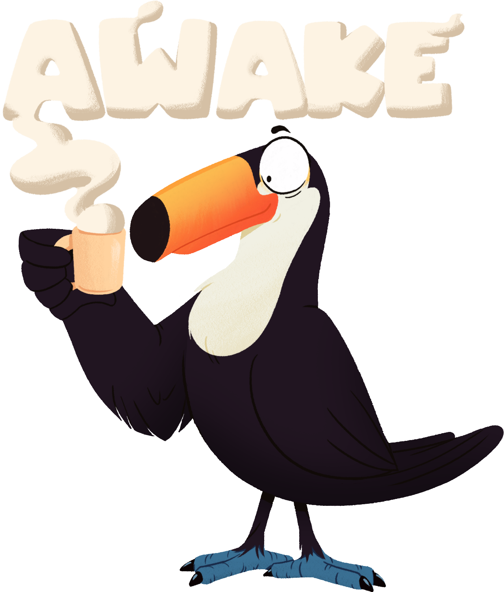

# Authorized Wire for Authenticated Key Exchange (AWAKE) Specification v0.3.0 



## Editors

* [Brooklyn Zelenka], [Fission]

## Authors

* [Brooklyn Zelenka], [Fission]

## Language

The key words "MUST", "MUST NOT", "REQUIRED", "SHALL", "SHALL NOT", "SHOULD", "SHOULD NOT", "RECOMMENDED", "MAY", and "OPTIONAL" in this document are to be interpreted as described in [RFC 2119].

# 0 Abstract

Authorized Wire for Authenticated Key Exchange (AWAKE) is a [mutually authenticating][mutual authentication] [AKE] for P2P applications. To root authority of both parties, AWAKE leverages the [UCAN] capability chain to prove access to some resource(s), validating that the requestor is communicating with a party capable of performing certain actions. 

# 1 Introduction

AWAKE bootstraps a secure session on top of a public channel. Key exchanges for point-to-point communication are plentiful, but in open, trustless protocols, rooting trust can be a barrier for ad hoc communications channels. Two common approaches are to use a trusted certificate authority, or ignore the principal and "merely" establish a point-to-point channel.

Capability-based systems have a helpful philosophy towards a third path. By emphasizing authorization over authentication, they provide a way to know something provable about what the other party "can do", even if they have no sure way of knowing "who they are". One way of phrasing this is that such an agent is "functionally equivalent to the principal in this context". AWAKE makes use of authorization to bootstrap point-to-point sessions that are both secure and mutually trusted.

## 1.1 Motivation

Applications in the client/server model typically use a certificate authority to root their trust. This presupposes that the client is able to dial the correct resource and ask for them to authenticate. The situation is somewhat more complex in P2P, [zero trust][ZTA], and [local-first] applications operating on open channels, where location is independent and eventual consistency allows for unlimited forking of resource access.

Authorization on its own is no longer sufficient for this situation: it is entirely possible validate _who_ a responder, but the more relevant information is _what they have access to._ For instance, are they a member of a group message, can they read from a particular database, or send email from a certain address?

## 1.2 Approach

Rather than building multiple tools for specialized use cases, the approach is to take high quality components that solve for the general case and add the minimal number of additions to fit the AWAKE context. To the largest degree possible, AWAKE composes existing protocols and tools.

[MLS] is currently the best vetted secure channel that includes P2P group management. [UCAN] allows for the representation of authority both with and without delegation, and is well suited for P2P and local-first use cases. By combining standards these with a thin layer of standard cryptographic patterns, AWAKE attempts to take the advantages of both while introducing the minimum of additional specification and implementation overhead.

# 2 Encryption

Encryption is core to securing a tunnel. Temporary key material and secrets created for AWAKE MUST be considered ephemeral and MUST NOT be reused between sessions.

While [MLS] is extremely robust, it does not allow for bidirectional authorization in the core protocol. Luckily, it is possible to extract this phase out to an AWAKE handshake ahead of starting a MLS.

At a high-level, AWAKE uses a [X25519] envelope to handshake into an authorized [MLS] session to establish a secure message channel.

All keys SHOULD be non-extractable where possible.
 
## 2.1 Asymmetric Keys

UCAN MUST be used as the handshake signature envelope for AWAKE. Any UCAN-compatible asymmetric key MAY be used for signatures, including RSA, EdDSA, ECDSA, and so on.

[ECDH handshakes][Authorize Provider] MUST use [X25519].

### 2.1.1 Symmetric Keys

All symmetric encryption in the pre-MLS AWAKE handshake MUST use [XChaCha-Poly1305]. These keys MUST be generated by the [AWAKE KDF], and SHOULD be non-extractable where possible.

Each encrypted payload MUST include a unique 24-byte [initialization vector][IV].

### 2.1.2 Key Derivation

AWAKE MUST use [HKDF] to derive keys. The shared secret MUST be generated using [X25519]. Non-extractable keys SHOULD be used where available. The sender MUST rotate their public key on every new session.

Key derivation in the AWAKE handshake MUST use the following algorithm:

``` javascript
// JS-flavored Pseudocode

const ecdhSecret = ecdh(aliceSk, bobPk)
const awakeTag = 0x4157414B452D5543414E // "AWAKE-UCAN" as hex
const pseudorandomBits = hkdf.generateBits({
  ecdhSecret, 
  salt: initialRequestorPublicKey,
  info: awakeTag, // No secret concatenated onto the tag
  bitLength: 608
})
const [XChaChaKey, iv, nextSecret] = pseudorandomBits.splitKeysAndIv()
```

Note that AWAKE key derivation step MUST [omit the the info parameter][HKDF Randomness], since no input secret is available.


## 2.2 Messaging Layer Security

After the AWAKE handshake, the protocol switches over to the Messaging Layer Security ([MLS]) protocol with UCAN credentials. MLS establishes an efficient post-compromise security channel with group management.

## 3 Sequence

AWAKE proceeds in one connection step, four communication rounds, and an OPTIONAL disconnection:

1. Both parties subscribe to a well-known channel
2. Requestor broadcasts intent
    * a. Temporary DID
    * b. Provider authorization criteria
3. Authorize Provider
    * a. Provider securely proves that they have sufficient rights
    * b. Provider transmits a session key via asymmetric key exchange
4. Authorize Requestor
    * a. Requestor sends an MLS connection request with their actual DID
    * b. Requestor sends instance validation (e.g. UCAN or out-of-band PIN)
5. Secure session messages (zero or more rounds) via MLS


# 4.1 Format

Payloads are encoding agnostic, but JSON is RECOMMENDED. For JSON, any fields that contain non-JSON values (such as ECDH public keys and encryption payloads) MUST be serialized as unpadded [Base64].

All payloads MUST include the "AWAKE version" field `awv: "0.3.0"`. Payloads MUST also include a message type field `type` (see each stage for the value). All field keys and message type values MUST be lowercase and treated as case-sensitive.

# 5. Protocol Steps

## 5.1 Subscribe to Common Channel

AWAKE begins by all parties listening on a common channel. AWAKE itself is channel and transport agnostic; it MAY be broadcast to all listeners, MAY be asynchronous, and MAY be over any transport. To reduce channel noise, it is RECOMMENDED that this channel be scoped to a specific topic.

For instance, a WebSocket pubsub channel on the topic `awake:did:key:zStEZpzSMtTt9k2vszgvCwF4fLQQSyA15W5AQ4z3AR6Bx4eFJ5crJFbuGxKmbma4` MAY be used for messages about resources owned by `did:key:zStEZpzSMtTt9k2vszgvCwF4fLQQSyA15W5AQ4z3AR6Bx4eFJ5crJFbuGxKmbma4`.

The AWAKE handshake MUST occur on a single channel. The underlying channel MAY be changed after the handshake is complete.

## 5.2 Requestor Broadcasts Intent

**NOTE: This stage is completely in the clear.**


### 5.1.1 Temporary ECDH DID

Since this message is sent entirely in the clear, the Requestor MUST generate a fresh X25519 key pair per AWAKE initialization attempt. This key MUST be used as the first step in the ECDH Double Ratchet. In the payload, the public key MUST be formatted as a [`did:key`].

This temporary key MUST only be used for key exchange, and MUST NOT be used for signatures, and MUST NOT be persisted past this one session bootstrap (i.e. discard after this step)

Where possible, it is RECOMMENDED that the private key be non-extractable.

### 5.1.2 Authorization Criteria

The Requestor MAY also include validation criteria expected from the Provider. This MUST be passed as a map of [UCAN capabilities]. The Provider MUST be able to prove access to these capabilities in [their response][Authorize Provider].

If no capabilities are required, the `caps` field MUST be set to an empty map (`{}`).

### 5.1.3 Payload

| Field  | Value          | Description                                    | Required |
| ------ | -------------- | ---------------------------------------------- | -------- |
| `awv`  | `"0.3.0"`      | AWAKE message version                          | Yes      |
| `type` | `"awake/init"` | Signal which step of AWAKE this payload is for | Yes      |
| `did`  |                | The Requestor's initial (temp) ECDH X25519     | Yes      |
| `caps` |                | Capabilities that the Provider MUST provide    | Yes      |

#### 5.1.3.1 JSON Example

``` javascript
{
  "awv": "0.3.0",
  "type": "awake/init",
  "did": "did:key:zDnaerx9CtbPJ1q36T5Ln5wYt3MQYeGRG5ehnPAmxcf5mDZpv",
  "caps": {
    "mailto:me@example.com": {
      "msg/send": [
        {"to": "/.*@example.com/"}
      ]
    },
    "dns:example.com": {
      "crud/update" [{}]
    }
  }
}
```

## 5.2 Authorize Provider 

**NOTE: The Provider is not yet trusted at this step, and MUST be treated as a possible impersonator or [PITM](https://en.wikipedia.org/wiki/Man-in-the-middle_attack)**

``` mermaid
sequenceDiagram
    participant Requestor
    participant Provider

    Note over Requestor, Provider: 2. Authorize Provider
        Provider ->> Requestor: ECDH🔐(Nullipotent UCAN & channel info)
```



In this step, the Provider MUST prove that they have access to the requested resources. This establishes trust in the UCAN capabilities of the Provider, but MUST NOT actually delegate anything. This UCAN MUST contain the Requestor's temporary X25519 DID in the `aud` field. The `iss` field MUST contain the Provider's actual DID (i.e. not a temporary X25519 DID).

The payload contains two encryption layers and a signature: the ECDH components, the XChaCha-Poly1305 envelope, and the capability proof signed by the Provider's "true" DID.


Upon receipt, the Requestor MUST validate that the UCAN capabilities in the proof fulfill their `caps` criteria. The UCAN itself MUST be valid, unrevoked, unexpired, and intended for the temporary DID (the `aud` field). If any of these checks fail, the session MUST be abandoned, the temporary DID regenerated, and the protocol restarted from [intention broadcast](#32-requestor-broadcasts-intent).

### 5.2.1 Payload

To start the Double Ratchet, the payload in this stage has the highest number of cleartext fields. Note that the value in the `iss` field MUST contain the temporary ECDH DIDs, and MUST NOT use the Provider's actual long-term DID. Conversely, the UCAN inside the encrypted payload MUST use the Provider's long-term DID.

| Field  | Value         | Description                                                         | Required |
| ------ | ------------- | ------------------------------------------------------------------- | -------- |
| `awv`  | `"0.3.0"`     | AWAKE message version                                               | Yes      |
| `type` | `"awake/res"` | "Provider's Auth" step message type                                 | Yes      |
| `iss`  |               | Provider's temporary ECDH X25519 DID                                | Yes      |
| `aud`  |               | The X25519 DID [signalled by the Requestor][Authorization Criteria] | Yes      | 
| `msg`  |               | Nullipotent validation UCAN encrypted with XChaCha-Poly1305         | Yes      |

#### 5.2.1.1 JSON Example

``` javascript
{
  "awv": "0.3.0",
  "type": "awake/res",
  "iss": responderStep3EcdhDid,
  "aud": requestorStep2EcdhDid,
  "msg": encryptedUcan 
}
```

### 5.2.2 Nullipotent UCAN

The Provider's UCAN MUST NOT be used to delegate any capabilities to the Requestor at this stage. This UCAN MUST only be used to prove access to capabilities. The issuer (`iss`) field MUST contain the Provider's long-term DID (rather than the temporary ECDH DID). The audience (`aud`) field MUST contain the Requestor's _temporary_ ECDH DID from the previous step.

This UCAN MUST be encrypted with a HKDF-generated XChaCha-Poly1305 key plus IV before being placed into the payload (below).

#### 5.2.2.1 Challenge

The Provider MUST set the method of challenge to validate the Requestor. This MUST be set in the `fct` section of the UCAN so that it is signed by the Provider. The RECOMMENDED authorization methods are out-of-band PIN validation (`oob-pin`) and UCAN (`ucan`).

To set the challenge as `oob-pin`, the `fct` section of the UCAN MUST include the following:

``` javascript
{
  ...,
  "fct": [
    ...,
    {"awake/challenge": "oob-pin"}
  ]
}
```

To set the challenge as `ucan`, the `fct` section of the UCAN MUST include the following:

``` javascript
{
  ...,
  "fct": [
    ...,
    { 
      "awake/challenge": "ucan",
      "cap": {...requiredCaps}
    }
  ]
}
```

If more than one `awake/challenge` field is set, the lowest-indexed one MUST be used.

## 5.3 Authorize Requestor

At this stage, the Provider has been validated, but the Requestor is still untrusted. The Requestor now has enough trust in the Provider to initiate an MLS session.

The Requestor now MUST provide their actual DID over the secure channel, and MUST prove that they are a trusted party rather than a PITM, eavesdropper, or phisher. This is accomplished in the [MLS Credentials] step.

> In order to ensure that MLS provides meaningful authentication it is important that each member is able to authenticate some identity information for each other member. Identity information is encoded in Credentials, so this property is provided by ensuring that members use compatible credential types.
>
> The types of credential that may be used in a group is restricted to what all members of the group support, as specified by the capabilities field of each LeafNode in the ratchet tree. An application can introduce new credential types by choosing an unallocated identifier from the registry in Section 17.5 and indicating support for the credential type in published LeafNodes, whether in Update proposals to existing groups or KeyPackages that are added to new groups. Once all members in a group indicate support for the credential type, members can start using LeafNodes with the new credential. Application may enforce that certain credential types always remain supported by adding a required_capabilities extension to the group's GroupContext, which would prevent any member from being added to the group that doesn't support them.
>
> — [MLS Protocol Specification], [13.3. Credential Extensibility]

## 5.3.1 Requestor Challenge

**NOTE: The Requestor is not yet trusted at this step, and MUST be treated as a possible impersonator or PITM**


The Requestor MUST provide the proof of authorization set by the [Provider payload][Provider challenge]. The RECOMMENDED authorization methods are PIN validation (`pin`) and UCAN (`ucan`).

It is RECOMMENDED that the handshake fail after a maximum number of failed validation attempts, or the attempts be rate limited with exponential backoff.

#### 5.3.1.1 Out-of-Band PIN Challenge

Out-of-band PIN challenges are most useful when the Requestor would not be able to provide UCAN validation, such as when signing into a new device that has not been delegated to yet. The PIN MUST be set by the Requestor, and transmitted out of band. Some examples of out of band transmission include displaying text on screen, email, text message, or QR code.

The PIN values MUST be within the UTF-8 character set. The PIN MUST be included in the `pin` field. It is RECOMMENDED that the PIN be restricted to human-readable characters, and 4 to 10 characters long. If a very long challenge is required, it is RECOMMENDED that the SHA2 hash of the challenge be used rather than putting a large challenge over the wire.

| Field  | Value                                                      | Description                 | Required |
| ------ | ---------------------------------------------------------- | --------------------------- | -------- |
| `did`  |                                                            | "Actual" Requestor DID      | Yes      |
| `sig`  | `sign(requestorPK, sha2_256(responderDid + outOfBandPin))` | Signature of challenge hash | Yes      |

```javascript
{
  "did": requestorActualDid,
  "sig": signedHash
}
```

#### 5.3.1.2 Direct UCAN Challenge

If UCAN auth is required by the Provider, the Requestor MUST provide a UCAN. This MUST be the same challenge strategy as the one set in the [Provider's payload][Provider challenge]: the UCAN MUST be encrypted with the session key and the IV from the enclosing payload, MUST be given in a raw format, and MUST be inline (without a JSON object wrapper or similar).

The UCAN MUST be issued (`iss`) by the Requestor's DID (not the temporary DID), and its audience (`aud`) MUST be the Provider's DID. The `att` field MUST be set to an empty array (i.e. it MUST NOT delegate any capabilities). The `prf` array MUST fulfill the capabilities set by the Provider.

This MAY be used to prove that the Requestor has the same capabilities that the Requestor required from the Provider to start the handshake, such as when enforcing a minimum security clearance or proving functional equivalence between a single user's trusted devices.


# 6. MLS Session

Proceed with MLS as normal.

# 7. Acknowledgements

Thanks to [Quinn Wilton] and [Daniel Holmgren] for their many contributions to previous version of this spec. While the spec has evolved significantly since then, their thinking drove much of the philosophy underlying the current version.

Many thanks to [Brian Ginsburg] for his exploration of AWAKE and suggestion to recommend backoff on requestor authorization attempts.

# 8 FAQ

## 8.1 Why not a variant without MLS for short sessions?

This is absolutely an option! However, it would require implementing a special case. Such a system could arguably be more efficient when the number of messages is extremely small, but having one well tested library that could handle more use cases was more strongly indicated in this revision of the spec.

## 8.2 Why not use FIPS-certified cryptography, such as P-256, RSA, and AES-GCM?

AWAKE as specified uses the best practices at time of writing. They are used in MLS, TLS, and more.

RSA is widely deployed, but the key sizes are becoming quite large for an acceptable level of security. The NIST elliptic curves (such as P-256) have suspicious parameters that have lead to [concerns over the presence of a backdoor][SafeCurves]. AES is widely used, but is more susceptible to being used incorrectly than XChaCha.

Many of the algorithms mentioned above are available as non-extractable in the [WebCrypto API]. This is a definite advantage for certain attack vectors, such as 

At time of writing, there is active effort in [bringing Ed25519/X25519 to the WebCrypto API][Secure Curves in WebCrypto]. Once this is complete, it is RECOMMENDED that all browser implementations make use of the non-extractable functionality.

## 8.3 Why HKDF instead of the BLAKE3 key derivation function?

Both HKDF and BLAKE3's KDF mode are widely accepted as being very good key derivation functions. MLS uses HKDF under the hood, and adding more primitives mainly adds to the package size for implementations.

## 8.4 Is AWAKE quantum-secure?

Many of the cryptographic algorithms used in AWAKE are susceptible to a hypothetical quantum computer of sufficient size. We are waiting for at least the NIST Post-Quantum Cryptography Standardization recommendations before updating the protocol's cryptography to account for this attack vector.

<!-- External Links -->

[13.3. Credential Extensibility]: https://messaginglayersecurity.rocks/mls-protocol/draft-ietf-mls-protocol.html#section-13.3
[AKE]: https://en.wikipedia.org/wiki/Authenticated_Key_Exchange
[Base64]: https://datatracker.ietf.org/doc/html/rfc4648
[Bluesky]: https://blueskyweb.xyz
[Brian Ginsburg]: https://github.com/bgins
[Brooklyn Zelenka]: https://github.com/expede
[Daniel Holmgren]: https://github.com/dholms
[Double Ratchet]: https://signal.org/docs/specifications/doubleratchet/
[Elliptic Curve Diffie-Hellman]: https://en.wikipedia.org/wiki/Elliptic-curve_Diffie%E2%80%93Hellman
[Fission]: https://fission.codes
[HKDF Randomness]: https://soatok.blog/2021/11/17/understanding-hkdf#how-should-you-introduce-randomness-into-hkdf
[HKDF]: https://datatracker.ietf.org/doc/html/rfc5869
[IV]: https://en.wikipedia.org/wiki/Initialization_vector
[MLS Credentials]: https://messaginglayersecurity.rocks/mls-protocol/draft-ietf-mls-protocol.html#name-credentials
[MLS Protocol Specification]: https://messaginglayersecurity.rocks/mls-protocol/draft-ietf-mls-protocol.html
[MLS]: https://messaginglayersecurity.rocks/
[Quinn Wilton]: https://github.com/QuinnWilton
[RFC 2119]: https://datatracker.ietf.org/doc/html/rfc2119
[SafeCurves]: https://safecurves.cr.yp.to/
[Secure Curves in WebCrypto]: https://blogs.igalia.com/jfernandez/2023/06/20/secure-curves-in-the-web-cryptography-api/
[Signal Protocol]: https://github.com/signalapp/libsignal
[UCAN capabilities]: https://github.com/ucan-wg/spec/#25-capability
[UCAN]: https://github.com/ucan-wg/spec
[WebCrypto API]: https://developer.mozilla.org/en-US/docs/Web/API/Web_Crypto_API
[WireGuard]: https://www.wireguard.com/
[X25519]: https://cryptography.io/en/latest/hazmat/primitives/asymmetric/x25519/
[XChaCha-Poly1305]: https://datatracker.ietf.org/doc/html/draft-irtf-cfrg-xchacha
[ZTA]: https://en.wikipedia.org/wiki/Zero_trust_security_model
[`did:key`]: https://w3c-ccg.github.io/did-method-key/#ed25519-x25519
[local-first]: https://www.inkandswitch.com/local-first/
[mTLS]: https://datatracker.ietf.org/doc/html/rfc8705
[mutual authentication]: https://en.wikipedia.org/wiki/Mutual_authentication

<!-- Internal Links -->

[AWAKE KDF]: #212-key-derivation
[Authorization Criteria]: #512-authorization-criteria
[Authorize Provider]: #52-authorize-provider
[Provider challenge]: #5221-challenge
